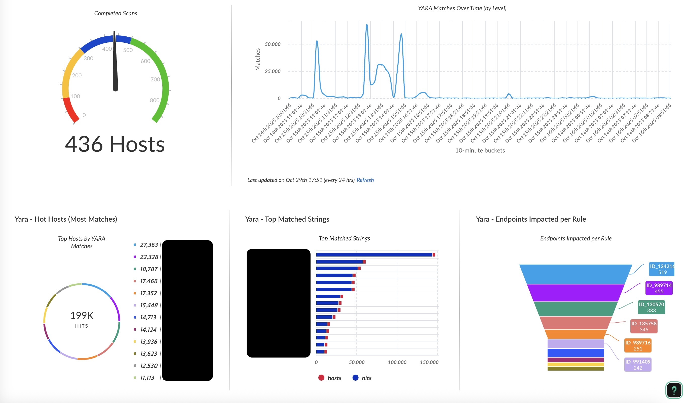
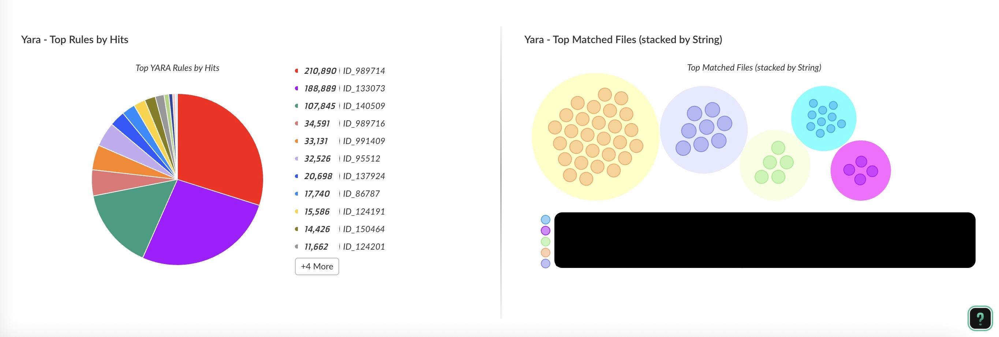
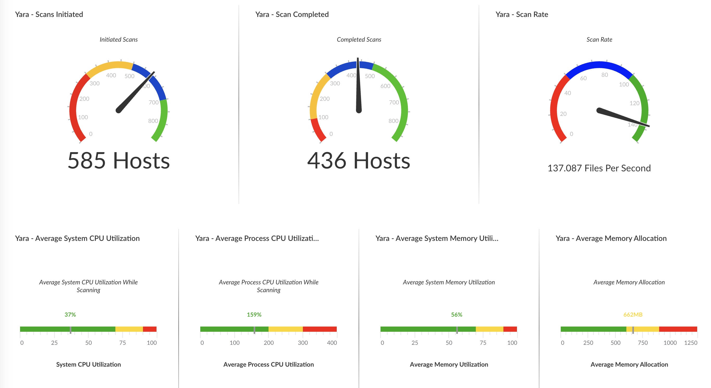
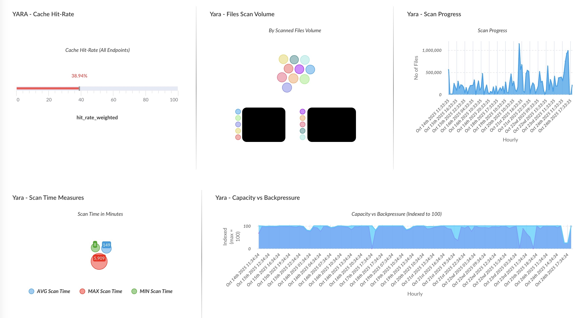
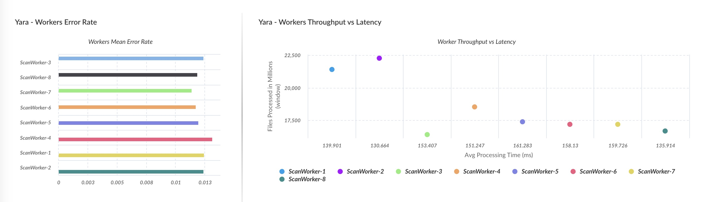

# YARA Scanner - Enterprise Threat Detection System

[](https://www.python.org/downloads/)
[](https://github.com/yourusername/yara-scanner)
[](LICENSE)

> **Production-ready YARA scanning engine with real-time threat reporting and comprehensive system monitoring**

A high-performance, multi-threaded file scanning solution designed for enterprise security operations. While the scanner is **general-purpose and platform-agnostic**, this repository and its associated content (dashboards, reports, playbooks) are **specifically optimized for deployment via Palo Alto Networks Cortex XDR and XSIAM agents**.

---

## 🎯 Primary Use Case: Cortex XDR/XSIAM Integration

This scanner is designed to be deployed and executed through **Cortex XDR/XSIAM agents** on endpoints, enabling:

- **Centralized threat visibility** across your entire endpoint estate
- **Real-time detection alerts** flowing directly into Cortex Data Lake
- **Automated response workflows** via playbooks
- **Executive dashboards** for performance and matching
- **Evidence collection** with automatic upload to XDR/XSIAM console

### 🔄 Scanner Versions: XDR vs. XSIAM

This repository provides two distinct scanner implementations tailored for different Cortex environments:

#### 1. `xdr_yara_scanner.py` (Cortex XDR)
Optimized specifically for the Cortex XDR environment. 
- **API Integration:** Uses the **Insert Parsed Alerts API** (`/public_api/v1/alerts/insert_parsed_alerts`) and expects an XDR API Key and API ID.
- **Data Payload:** Formats YARA matches into the strict XDR Parsed Alerts schema (`{"request_data": {"alerts": [...]}}`).
- **Telemetry:** By default, only uploads positive YARA matches (`UPLOAD_NON_MATCH_DATA = False`), relying on the XDR agent itself for general endpoint telemetry.

#### 2. `xsiam_yara_scanner.py` (Cortex XSIAM)
Optimized for Cortex XSIAM using a generic HTTP Event Collector or Webhook endpoint.
- **API Integration:** Connects to a generic webhook or HTTP Event Collector endpoint, using a single API Key.
- **Data Payload:** Uploads standardized JSON objects directly, ideal for raw log ingestion in XSIAM.
- **Telemetry:** Uploads full telemetry including non-match data, performance metrics, and statistics (`UPLOAD_NON_MATCH_DATA = True`) directly to the SIEM.
- **Advanced Rule Support:** Features an advanced YARA rule parser, exposes custom external variables (`filename`, `filepath` to the rules), and provides detailed fallback summaries for condition-only rule matches.

### 🏢 Enterprise Architecture

```
┌─────────────────────────────────────────────────────────────┐
│                    Cortex XSIAM/XDR                         │
│    ┌──────────────┐  ┌──────────────┐  ┌──────────────┐     │
│    │  Dashboards  │  │   Playbooks  │  │    Alerts    │     │
│    └──────────────┘  └──────────────┘  └──────────────┘     │
│         ▲                  ▲                  ▲             │
│         └──────────────────┴──────────────────┘             │
│                     WebHook Ingestion                       │
└─────────────────────────────────────────────────────────────┘
                            ▲
                            │ HTTPS
                            │
         ┌──────────────────┴─────────────────┐
         │                                    │
    ┌────▼─────┐                         ┌────▼─────┐
    │ Endpoint │                         │ Endpoint │
    │ (Windows)│                         │  (Linux) │
    │          │                         │          │
    │ XDR Agent│                         │ XDR Agent│
    │    │     │                         │    │     │
    │    ▼     │                         │    ▼     │
    │  Scanner │                         │  Scanner │
    └──────────┘                         └──────────┘
```

---

---

## 🔄 v2 Updates (XDR Edition — `xdr_yara_scanner.py`)

This release reworks the XDR scanner around operator control, correct XDR API delivery, and dashboard-ready telemetry. **Defaults preserve prior behavior**, except matched-file copying now defaults **off**.

### 🔐 Authentication — Advanced (HMAC) support
The scanner now supports both Cortex XDR API auth models and **auto-detects** which the tenant expects:
- **Advanced** — per-request `x-xdr-nonce` + `x-xdr-timestamp` + `Authorization = sha256(key + nonce + timestamp)`
- **Standard** — plain `Authorization: <key>` + `x-xdr-auth-id`

Set `XDR_AUTH_TYPE` (`auto` | `advanced` | `standard`, default `auto`) to override. All API calls (Insert Parsed Alerts, `add_dataset`, `add_data`, `get_datasets`) route through one `build_xdr_headers()` helper. *Advanced-key tenants previously received nothing — the Standard-only header returned HTTP 401 on every upload.*

### 🎛️ Runtime options (`options` parameter)
Passed as a compact `key=value,key=value` string (also available as env-var fallbacks for standalone runs). All are optional:

| Option | Values | Default | Effect |
|--------|--------|---------|--------|
| `create_alerts` | true/false | `true` | Insert Parsed Alerts (feeds XDR alerts → incident creation) |
| `write_dataset` | true/false | `true` | Write to the lookup datasets |
| `collect_files` | true/false | **`false`** | Copy matched files into the evidence zip (metadata-only when off) |
| `throttle_mode` | script/os/off | `script` | CPU pacing strategy (below) |
| `cpu_high_threshold` | 1–100 | `80` | Pause-entry threshold (% system CPU) |
| `cpu_critical_threshold` | 1–100 | `90` | Critical threshold (logged separately) |
| `max_pause_secs` | ≥0 (`0`=unbounded) | `300` | Cap on one continuous CPU pause |
| `tenant_id` | string | derived | Override the tenant slug (else parsed from the API URL) |

Every run's summary and logs include a **posture** string, e.g. `alerts=on dataset=on files=off throttle=script mode=scan`.

### 🧮 Resource management
- **Configurable throttling** via the thresholds above (was hardcoded).
- **Enhanced sleep logic** — a worker over the high threshold now *stays paused and re-checks CPU each interval*, resuming only once CPU drops below `high − 10` (hysteresis), bounded by `max_pause_secs` so a permanently busy host still finishes. Cumulative pause time is reported per scan.
- **`throttle_mode=os`** hands pacing to the OS: script sleeps are disabled and the process drops to idle-tier priority (Windows `IDLE`/background mode; Linux `nice 19` + `ionice idle`; macOS `nice 19`). `throttle_mode=off` disables throttling entirely for maintenance windows.

### 🛑 Scan cancellation via Action Center
Run the same script with `mode=cancel` on the endpoint to drop a cooperative cancel flag; a running scan's watcher detects it within ~5 s and shuts down gracefully — draining uploaders, writing a terminal `cancelled` lifecycle row, and returning `Scan cancelled by operator: …` (exit 0). POSIX `SIGTERM`/`SIGINT` route into the same path.

### 🗂️ Lookup datasets + tenant identity
Two **per-endpoint sharded** datasets (`_v2_<host>`) — the fix for XDR's `add_data` concurrency limitation, where many endpoints writing one shared dataset collide on a server-side clone-table race and lose rows. One writer per dataset lands 100% at any fleet scale; dashboards fan the shards back in with a `yara_scanner_matches*` wildcard.
- **`yara_scanner_matches_v2_<host>`** — one row per matched string; carries `tenant_id`, `scan_date`, `os_type`, `file_size`, `scan_folder`, `matched_length`.
- **`yara_scanner_scans_v2_<host>`** — scan lifecycle rows (`initiated` / `running` heartbeat / `completed` / `cancelled` / `failed`) with counts, `os_type`, `scan_folder`, throttle mode, paused time, and posture.

Sharding is configurable (`lookup_shard` option / `YARA_LOOKUP_SHARD`: `endpoint` default, `none`, or a literal). The `_v2` tag is a schema version (bump on row-shape changes). Growth is bounded by the `scan_date` column (targeted `lookups/remove_data` pruning). Each run also drops a machine-readable `scan_summary_<run_id>.json` on the endpoint.

### 🌐 Scan scope
Browser caches are **no longer bypassed** (removed from the skip list), and a `force_scan_fragments` allowlist re-opens browser caches on macOS where the broad `Library/Caches/` exclusion would otherwise swallow them.

### 🩹 Platform fixes
- macOS cleanup now uses a **launchd** LaunchDaemon (was incorrectly writing a systemd unit and failing every run).
- The cleanup script is **generated from the real alert directory** (the old embedded scripts pointed at a non-existent `xdr-data` path, so cleanup silently did nothing).
- CPU sampler is primed at start (the first `psutil.cpu_percent()` reads 0 and skipped the first throttle window).
- Hosts without systemd log-and-skip cleanup instead of erroring.

### 📊 Dashboard & 🧪 test skill
- New **`dashboards/Yara XDR Scanner (Lookup).json`** + `widgets/xdr_lookup/*.xql` built on the sharded lookup datasets via the `yara_scanner_matches*` / `yara_scanner_scans*` wildcards (every widget carries `tenant_id`).
- A bundled Claude skill, **`.claude/skills/xdr-yara-scan-test/`**, drives the scanner on a live endpoint through the XDR API (via `run_snippet_code_script`, no library upload) and verifies the datasets. See its `SKILL.md`.

### 🎛️ Automation playbooks
- **`playbooks/YARA_Scanner_Runner.yml`** and **`playbooks/YARA_Scanner_Canceller.yml`** launch / cancel the scanner on targeted agents via the built-in **Cortex Core - IR** integration (`core-get-scripts` → `core-get-endpoints` → `core-script-run`), for manual runs or scheduled **Jobs**.
- Works on Cortex XDR (the `edr` module) and XSIAM. **Prerequisite:** the scanner must be uploaded to the Action Center library with exactly the 5 string inputs (`yarafile, scan_folder, alert_severity, mode, options`) — `core-script-run` rejects a mismatched parameter set. See `playbooks/README.md` for import, run, Job scheduling, and verification.

### 📘 Deployment guides
Step-by-step deployment guides (Markdown + Word) live in **`docs/guides/`**:
- **`XDR_YARA_Scanner_Guide`** — Advanced/Standard auth, library upload with the 5 inputs, run via UI/API/playbook, cancellation, lookup datasets + dashboard, XQL recipes.
- **`XSIAM_YARA_Scanner_Guide`** — HTTP Log Collector + parsing rule, `yara_scans_raw` ingestion, dashboards, XQL recipes, tuning.

---

## ✨ Key Features

### Core Capabilities
- 🚀 **Multi-threaded Scanning** - Configurable worker threads for optimal performance
- 🔄 **Circuit Breaker Pattern** - Resilient API uploads with exponential backoff
- 🗂️ **Evidence Collection** - Automatic packaging with SHA256 hashing
- 🧹 **Automated Cleanup** - Scheduled post-scan cleanup via Task Scheduler/systemd
- 🌐 **Cross-Platform** - Full support for Windows, Linux, and macOS

### Monitoring & Observability
- 📊 **System Resource Monitoring** - CPU, memory, disk I/O, network metrics
- 📈 **Performance Tracking** - Scan rates, worker efficiency, cache hit rates
- 📝 **Categorized Logging** - Separate logs for alerts, errors, performance, uploads
- ⚡ **Real-time Statistics** - Progress tracking with ETA calculations

### Enterprise Integration
- 📡 **Real-Time Streaming Uploads** - Uses a producer/consumer queue model with a dedicated background thread to stream alerts to XDR/XSIAM instantly as matches are found, rather than waiting for the entire scan to finish.
- 🔄 **Resilient API Delivery** - Built-in exponential backoff, timeout protection, and local `.json` file backups guarantee data preservation even if rate-limited or disconnected.
- 🔐 **Embedded Authentication** - API credentials are hardcoded securely directly into the scripts for simplified endpoint deployment.
- 🎯 **Standardized Log Format** - JSON-based structured logging mapped directly to Cortex XDR and XSIAM schemas.

---

## 🚀 Quick Start

### Prerequisites

```bash
# Python 3.8 or higher
python --version

# Required packages
pip install -r requirements.txt
```

### Basic Usage

Choose the appropriate script (`xdr_yara_scanner.py` or `xsiam_yara_scanner.py`) based on your target platform.

#### 1. **Standalone Execution** (Testing/Development)
```bash
# Custom YARA rules (base64 encoded) using the XSIAM scanner
python xsiam_yara_scanner.py "eW91cl9iYXNlNjRfcnVsZXM="

# Specific folder scan
python xsiam_yara_scanner.py "eW91cl9iYXNlNjRfcnVsZXM=" "/path/to/scan"

# With specific alert severity
python xsiam_yara_scanner.py "eW91cl9iYXNlNjRfcnVsZXM=" "/path/to/scan" "high"
```

#### 2. **Cortex XDR/XSIAM Deployment** (Production)

Deploy via XDR/XSIAM Action Center:

```python
# XDR/XSIAM Script Arguments
args = {
    "yarafile": "base64_encoded_yara_rules",
    "scan_folder": "default",  # or specific path
    "alert_severity": "low"    # optional severity level
}
```

---

## 📋 Command-Line Arguments

| Position | Parameter | Description | Default | Example |
|----------|-----------|-------------|---------|---------|
| 1 | `yarafile` | Base64-encoded YARA rules | Built-in rules | `"cnVsZSB0ZXN0IHsgLi4uIH0="` |
| 2 | `scan_folder` | Target directory path | Full system scan | `"/home/user"` or `"C:\\"` |
| 3 | `alert_severity`| Desired severity level | `"low"` | `"high"` |
| 4 | `mode` | `scan` or `cancel` (deliver a cancel to a running scan) | `"scan"` | `"cancel"` |
| 5 | `options` | `key=value,key=value` runtime options (see v2 section) | none | `"create_alerts=false,throttle_mode=os"` |

**Note:** Use an empty string `""` to skip a parameter and use its default value. API Credentials are no longer passed via command-line arguments and must be embedded directly in the script source. See the **v2 Updates** section below for the `mode` / `options` surface, authentication, datasets, cancellation, and the bundled test skill.

---

## 🔧 Configuration

### Environment Variables (Alternative to CLI args)

```bash
export YARA_THREADS=8              # Number of worker threads (default: CPU count)
export YARA_MAX_MB=100             # Max file size to scan in MB (0 = no limit)
```

### Scan Behavior

The scanner automatically adjusts behavior based on privileges:

**Linux/macOS:**
- **Root user**: Full system scan from `/`
- **Non-root user**: Limited to accessible directories (home, tmp, opt, etc.)
- **Recommendation**: Run with `sudo` for comprehensive coverage

**Windows:**
- Scans all available drives by default
- Skips system-protected directories (e.g., `C:\ProgramData\Cyvera`)
- Administrative privileges recommended

---

## 📊 Output & Artifacts

### Directory Structure

```
Windows:     C:\yara_scanner\
Linux:       /opt/yara_scanner/
macOS:       /usr/local/yara_scanner/

├── logs/                          # Categorized log files
│   ├── alerts_YYYYMMDD_HHMMSS.log
│   ├── statistics_YYYYMMDD_HHMMSS.log
│   ├── performance_YYYYMMDD_HHMMSS.log
│   ├── uploads_YYYYMMDD_HHMMSS.log
│   ├── scan_errors_YYYYMMDD_HHMMSS.log
│   ├── yara_processing_YYYYMMDD_HHMMSS.log
│   └── script_exceptions_YYYYMMDD_HHMMSS.log
│
├── alert/                         # Detection alert files (per rule)
│   └── [RuleName].txt
│
├── evidence/                      # Matched files and metadata
│   ├── evidence_hostname_timestamp.zip
│   ├── file_mapping.txt
│   └── yara_matches_hostname_timestamp.json
│
├── failed_rules/                  # Rules that failed compilation
│   └── failed_rule_[name].yar
```

### Log Categories

| Log Type | Description | XDR Integration |
|----------|-------------|-----------------|
| **Alerts** | YARA detection events | ✅ Auto-uploaded |
| **Statistics** | Scan metrics & progress | ✅ Dashboard data |
| **Performance** | System resource usage | ✅ Monitoring |
| **Uploads** | Webhook transmission logs | 📊 Diagnostic |
| **Errors** | Scan failures & issues | ⚠️ Alert triggers |
| **Compilation Errors** | YARA rule validation | 🔍 Rule debugging |
| **Script Exceptions** | Critical failures | 🚨 Incident response |

---

## 📤 API Payloads & Telemetry

### XDR Payload Schema
When running `xdr_yara_scanner.py`, only **positive YARA matches** are uploaded to Cortex XDR via the **Insert Parsed Alerts API** (`/public_api/v1/alerts/insert_parsed_alerts`). The deep forensic details are embedded as a stringified JSON object inside the `alert_description` field.

#### What data is collected and shipped?
1. **Endpoint Identity**: Hostname, OS info, and Local IPv4 Address.
2. **Detection Context**: YARA rule name, severity level, and timestamp.
3. **Forensic Evidence**: The exact file path (`filename`), the matched byte sequence (`string`), its identifier (`match`), the byte offset (`offset`), and the file's SHA256 hash and creation time.

#### Example XDR Payload
```json
{
  "request_data": {
    "alerts": [
      {
        "product": "YARA Scanner",
        "vendor": "Custom",
        "local_ip": "10.0.1.45",
        "local_port": 65535,
        "remote_ip": "127.0.0.1",
        "remote_port": 65535,
        "event_timestamp": 1715693452,
        "severity": "High",
        "alert_name": "YARA Match: Ransomware_WannaCry | Host: WIN-SRV-PROD1 | Time: 1715693452",
        "action_status": "Reported",
        "alert_description": "{\"source\": \"yara_scanner\", \"scan_id\": \"startup_20240514_104522_123456\", \"hostname\": \"WIN-SRV-PROD1\", \"os_info\": \"Windows-10-10.0.19045-SP0\", \"ip_address\": \"10.0.1.45\", \"message\": \"YARA match: rule 'Ransomware_WannaCry' in C:\\\\Users\\\\Admin\\\\Downloads\\\\invoice.exe\", \"network_fields_are_placeholders\": true, \"match_data\": {\"filename\": \"C:\\\\Users\\\\Admin\\\\Downloads\\\\invoice.exe\", \"rule\": \"Ransomware_WannaCry\", \"string\": \"WNcry@2ol7\", \"offset\": \"1024\", \"match\": \"$s1\", \"dateOfScan\": \"2024-05-14T10:45:22.123456\", \"file_sha256\": \"82b8a1c3bb545938023c7270e5b7c7b89736e6e2\", \"file_creation_time\": 1715600000.0}}"
      }
    ]
  }
}
```

### XSIAM Webhook Payload Schema
Unlike the XDR edition which strictly sends alerts, the `xsiam_yara_scanner.py` acts as a comprehensive telemetry agent. It sends **raw JSON logs** directly to a generic Cortex XSIAM Webhook or HTTP Event Collector endpoint. 

By default, the scanner uploads **4 distinct types of telemetry** to provide full operational visibility: `yara_match`, `scan_status`, `performance`, and `error`.

#### Standardized Base Structure
Every log sent to XSIAM shares a consistent base JSON envelope (`StandardLogEntry`).

```json
{
  "type": "<yara_match | scan_status | performance | error>",
  "hostname": "WIN-SRV-PROD1",
  "os_info": "Windows-10-10.0.19045-SP0",
  "ipAddress": "10.0.1.45",
  "timestamp": 1715693452.123456,
  "timestamp_iso": "2024-05-14T10:45:22.123456",
  "scan_id": "startup_20240514_104522",
  "uploader_version": "enhanced_v2",
  "source": "yara_scanner",
  "message": "<Human readable summary>",
  "level": "<INFO | WARNING | ERROR>",
  "data": { }
}
```

#### Payload Types (`data` field)

**1. YARA Match Logs** (`type: "yara_match"`)
```json
"data": {
  "filename": "C:\\Temp\\malicious.dll",
  "rule": "APT_Lazarus_Backdoor",
  "threat_level": "high",
  "string": "cmd.exe /c start",
  "offset": "2048",
  "match": "$str1",
  "match_scope": "string",
  "string_match_count": 3,
  "file_sha256": "82b8a1c3bb545938023c7270e5b7c7b89736e6e2",
  "file_creation_time": 1715600000.0,
  "dateOfScan": "2024-05-14T10:45:22.123456"
}
```

**2. Scan Status Logs** (`type: "scan_status"`)
```json
"data": {
  "scan_status": "running",
  "files_scanned": 15430,
  "files_skipped": 120,
  "detections_found": 5,
  "current_file": "C:\\Windows\\System32\\ntdll.dll",
  "scan_rate_files_per_second": 257.16,
  "elapsed_time_seconds": 60,
  "valid_rules_count": 1500,
  "failed_rules_count": 2
}
```

**3. Performance Metrics** (`type: "performance"`)
```json
"data": {
  "cpu_percent": 14.5,
  "memory_mb": 450.2,
  "memory_percent": 2.8,
  "disk_io_read_mb": 1024.5,
  "queue_size": 50,
  "active_workers": 8,
  "files_scanned": 15430
}
```

---

## 📊 Pre-Built Dashboards & Widgets

This repository includes **production-ready dashboards and XQL queries** for comprehensive visibility into YARA scanning operations across your enterprise.

### 📁 Repository Structure

```
yara-scanner/
├── dashboards/                    # Dashboard definitions (JSON)
│   ├── Yara_Matches.json         # Threat detection dashboard
│   └── Yara_Scan_Performance.json # Operational metrics dashboard
│
├── widgets/                       # Individual XQL widget queries
│   ├── matches/                   # Detection-focused widgets
│   │   ├── top_rules_by_hits.xql
│   │   ├── top_matched_files.xql
│   │   ├── hot_hosts.xql
│   │   ├── endpoints_per_rule.xql
│   │   └── matches_over_time.xql
│   │
│   └── performance/               # Operational metrics widgets
│       ├── worker_error_rate.xql
│       ├── throughput_vs_latency.xql
│       ├── cache_hit_rate.xql
│       ├── scan_progress.xql
│       ├── system_metrics.xql
│       └── capacity_backpressure.xql
│
└── images/                        # Dashboard screenshots
    ├── Matches_1.jpg
    ├── Matches_2.jpg
    ├── Performance_1.jpg
    ├── Performance_2.jpg
    └── Performance_3.jpg
```

---

## 🎯 Dashboard 1: YARA Matches & Threat Detection

**Purpose:** Real-time visibility into YARA rule detections across your endpoint fleet.

**Location:** `dashboards/Yara_Matches.json`

### Key Metrics & Visualizations



#### 🔴 **Top YARA Rules by Hits**
- **Type:** Pie chart with tabular breakdown
- **Insight:** Identifies which detection rules are triggering most frequently
- **Use Case:** Prioritize threat investigation and rule tuning
- **Example Data:** ID_989714 (210,890 hits), ID_133073 (188,889 hits)

#### 📦 **Top Matched Files (Stacked by String)**
- **Type:** Bubble chart
- **Insight:** Shows which files are triggering multiple YARA strings
- **Use Case:** Identify commonly flagged binaries or potential false positives

---



#### 🏥 **Completed Scans**
- **Type:** Gauge (436 hosts)
- **Insight:** Track scan completion rate across endpoints
- **Use Case:** Monitor deployment success and coverage

#### 📈 **YARA Matches Over Time**
- **Type:** Time series (10-minute buckets)
- **Insight:** Identify detection spikes and temporal patterns
- **Use Case:** Correlate with incidents, campaigns, or user activity

#### 🔥 **Hot Hosts (Most Matches)**
- **Type:** Ring chart (199K total hits)
- **Insight:** Pinpoint endpoints with highest detection rates
- **Use Case:** Prioritize incident response and forensics
- **Top Hosts:** 27,363 hits, 22,328 hits, 18,787 hits

#### 🎯 **Top Matched Strings**
- **Type:** Horizontal bar chart (hosts vs hits)
- **Insight:** See which specific YARA strings are matching most
- **Use Case:** Fine-tune detection logic and reduce noise

#### 🌊 **Endpoints Impacted per Rule**
- **Type:** Funnel chart
- **Insight:** Visualize rule reach across the endpoint estate
- **Use Case:** Assess rule effectiveness and coverage
- **Example:** ID_124212 (519 endpoints), ID_989714 (455 endpoints)

### Dashboard Import

```bash
# In Cortex XDR/XSIAM:
# 1. Navigate to Dashboards → Import
# 2. Upload: dashboards/Yara_Matches.json
# 3. Verify data ingestion from webhook endpoint
```

---

## ⚡ Dashboard 2: YARA Scan Performance & Operations

**Purpose:** Monitor scanner health, efficiency, and resource utilization.

**Location:** `dashboards/Yara_Scan_Performance.json`

### Key Metrics & Visualizations



#### ⚠️ **Workers Error Rate**
- **Type:** Horizontal bar chart (per worker thread)
- **Insight:** Identify problematic workers or systemic issues
- **Use Case:** Troubleshoot scanning errors and optimize thread count
- **Normal Range:** < 0.01 (1%) error rate

#### 🚀 **Workers Throughput vs Latency**
- **Type:** Scatter plot
- **Insight:** Balance between file processing speed and response time
- **Use Case:** Optimize worker thread configuration
- **Example:** ScanWorker-1 (21.3M files, 139ms avg latency)

---



#### 💾 **Cache Hit-Rate**
- **Type:** Progress bar (38.94%)
- **Insight:** Percentage of files served from cache vs rescanned
- **Use Case:** Assess cache effectiveness and tune LRU size
- **Expected:** 60-80% on subsequent scans

#### 📦 **Files Scan Volume**
- **Type:** Bubble chart by endpoint
- **Insight:** Compare scan workloads across different hosts
- **Use Case:** Identify outliers and capacity planning

#### 📊 **Scan Progress**
- **Type:** Time series (hourly buckets)
- **Insight:** Visualize scan progression in real-time
- **Use Case:** Monitor active scans and estimate completion

#### ⏱️ **Scan Time Measures**
- **Type:** Multi-metric display
- **Metrics:** 
  - AVG Scan Time: 1.149 minutes
  - MAX Scan Time: 5.909 minutes
  - MIN Scan Time: 8 seconds
- **Use Case:** SLA compliance and performance benchmarking

#### 📈 **Capacity vs Backpressure**
- **Type:** Area chart (indexed to 100)
- **Insight:** Queue depth vs processing capacity over time
- **Use Case:** Detect bottlenecks and scale worker threads
- **Healthy State:** Consistent capacity with minimal backpressure

---



#### 🎬 **Scans Initiated**
- **Type:** Gauge (585 hosts)
- **Insight:** Total endpoints where scans started
- **Use Case:** Track deployment reach

#### ✅ **Scan Completed**
- **Type:** Gauge (436 hosts)
- **Insight:** Successfully finished scans
- **Use Case:** Calculate completion rate (74.5% in example)

#### ⚡ **Scan Rate**
- **Type:** Gauge (137.087 files/second)
- **Insight:** Real-time file processing throughput
- **Use Case:** Performance monitoring and capacity planning

#### 🖥️ **System Resource Metrics**
- **Average System CPU Utilization:** 37% (healthy)
- **Average Process CPU Utilization:** 159% (multi-threaded)
- **Average System Memory Utilization:** 56% (moderate)
- **Average Memory Allocation:** 662MB (per scanner instance)

**Use Case:** Ensure scanner doesn't impact endpoint performance

### Dashboard Import

```bash
# In Cortex XDR/XSIAM:
# 1. Navigate to Dashboards → Import
# 2. Upload: dashboards/Yara_Scan_Performance.json
# 3. Configure refresh interval (recommended: 5 minutes)
```

---

## 🔧 Widget Customization

All XQL queries are modular and can be used independently or combined into custom dashboards.

### Example: Using Individual Widget Queries

```xql
// From: widgets/matches/top_rules_by_hits.xql
dataset = xdr_data
| filter log_type = "yara_match"
| comp count() as hits by rule
| sort desc hits
| limit 10

// From: widgets/performance/worker_error_rate.xql
dataset = xdr_data
| filter source = "yara_scanner" and log_type = "error"
| comp count() as errors by worker_id
| sort desc errors
```

### Combining Widgets

```xql
// Create a custom multi-metric widget
dataset = xdr_data
| filter source = "yara_scanner"
| comp 
    count_distinct(hostname) as endpoints_scanned,
    count(case log_type = "yara_match" then 1) as total_detections,
    avg(case log_type = "performance" then scan_rate) as avg_scan_rate,
    avg(case log_type = "performance" then cache_hit_rate) as avg_cache_rate
| alter 
    detection_rate = total_detections / endpoints_scanned,
    efficiency_score = (avg_scan_rate * avg_cache_rate) / 100
```

---

## 🎯 Cortex XDR/XSIAM Integration

### XQL Query Examples

```xql
// Recent YARA detections across all endpoints
dataset = xdr_data
| filter log_type = "yara_match"
| fields timestamp, hostname, rule, filename, offset
| sort desc timestamp

// Top 10 most triggered rules
dataset = xdr_data
| filter log_type = "yara_match"
| comp count() as detection_count by rule
| sort desc detection_count
| limit 10

// Endpoints with failed scans
dataset = xdr_data
| filter log_type = "error" and source = "yara_scanner"
| comp count() as error_count by hostname
| filter error_count > 0
```

### Automated Response Playbooks

Sample XDR playbook triggers:
- **High-severity detections** → Isolate endpoint + Create incident
- **Multiple detections** → Initiate forensic collection
- **Scan failures** → Alert SOC + Retry with elevated privileges

---

## 🛡️ Security Considerations

### API Key Management

For simplified deployment via Cortex XDR or XSIAM Action Center, API credentials are now **hardcoded directly within the script source**. 

Before deploying either script, you must open it and update the default credential variables near the top of the file:

**XDR Edition:**
```python
DEFAULT_XDR_API_KEY = "your_actual_api_key"
DEFAULT_XDR_API_ID = "your_actual_api_id"
DEFAULT_XDR_API_URL = "your_actual_api_url"
```

**XSIAM Edition:**
```python
API_KEY = "your_actual_api_key"
API_ENDPOINT = "your_actual_webhook_url"
```
*Note: Do not check these modified scripts into public version control after adding your credentials.*

### Permissions

- Scanner requires read access to target files
- Evidence collection requires write access to output directory
- Cleanup scheduling requires elevated privileges (admin/root)
- XDR API uploads require network connectivity

### Data Handling

- **Matched files**: Automatically collected and zipped with SHA256 hashes
- **Sensitive data**: Ensure YARA rules don't match PII/credentials
- **Retention**: Evidence packages should be managed per compliance requirements

---

## 🐛 Troubleshooting

### Common Issues

#### 1. **Permission Denied Errors**
```
Files skipped: 15,432 | Reason: Permission denied
```
**Solution:** Run with elevated privileges (`sudo` on Linux/macOS, Administrator on Windows)

#### 2. **YARA Rule Compilation Failures**
```
Failed rules skipped: 5 | Check yara_processing_*.log
```
**Solution:** Review `failed_rules/` directory and validate YARA syntax. Scanner continues with valid rules.

#### 3. **Webhook Upload Failures**
```
Upload errors: 127 | Check uploads_*.log
```
**Solution:** Verify API endpoint connectivity, check API key validity, review rate limits.

#### 4. **High Memory Usage**
```
Memory: 4.2GB | Files: 1.2M scanned
```
**Solution:** Adjust cache size or run in batches. Cache auto-scales based on available RAM.

### Debug Mode

Enable verbose logging:
```bash
# Set environment variable before running
export YARA_SCANNER_DEBUG=1
python yara_scanner.py
```

---

## 📈 Performance Tuning

### Recommended Settings by System Size

| System Profile | Worker Threads | Max File Size |
|----------------|----------------|---------------|
| **Laptop/Workstation** | 4-8 | 50 MB |
| **Server (16 GB RAM)** | 8-16 | 100 MB |
| **Server (32+ GB RAM)** | 16-32 | 200 MB |

### Optimization Tips

1. **Skip patterns**: Customize the ignored directories in `ScanConfig` to avoid scanning low-risk or high-volume paths.
2. **Network scans**: Consider local execution on the endpoint itself rather than scanning mounted network shares to avoid I/O bottlenecks.
3. **Resource Limits**: Adjust `YARA_MAX_MB` environment variable if encountering large file timeouts.
*Note: The LRU File Caching mechanism is currently disabled by default (Roadmap Feature).*

---

## 🤝 Contributing

This repository focuses on **Cortex XDR/XSIAM deployment scenarios**. Contributions welcome for:

- Dashboard templates
- Correlation rules
- XQL query examples
- Playbooks
- Performance optimizations
- Bug fixes and error handling

**Note:** For general YARA scanning use cases outside XDR/XSIAM, consider forking the scanner core.

---

## 📚 Additional Resources

### Palo Alto Networks Documentation
- [Cortex Documentation Hub](https://docs.paloaltonetworks.com/cortex)
- [Extended Query Language (XQL)](https://docs-cortex.paloaltonetworks.com/r/Cortex-XDR/Cortex-XDR-4.x-Documentation/Get-started-with-XQL)

### YARA Resources
- [YARA Documentation](https://yara.readthedocs.io/)
- [Writing YARA Rules](https://yara.readthedocs.io/en/stable/writingrules.html)
- [YARA-Python API](https://yara.readthedocs.io/en/stable/yarapython.html)

---

## 📄 License

This project is licensed under the MIT License - see the [LICENSE](LICENSE) file for details.

---

## 🙏 Acknowledgments

- **YARA** by VirusTotal for the powerful pattern matching engine
- **Palo Alto Networks** for the Cortex XDR/XSIAM platform
- **Open Source Community** for Python security tooling ecosystem

---

## 📞 Support

- **Issues**: [GitHub Issues](https://github.com/yourusername/yara-scanner/issues)
- **Discussions**: [GitHub Discussions](https://github.com/yourusername/yara-scanner/discussions)
- **XDR Support**: Contact Palo Alto Networks TAC for platform-specific issues

---

<div align="center">

**Built for enterprise security teams leveraging Cortex XDR/XSIAM**

⭐ Star this repository if you find it useful! ⭐

</div>